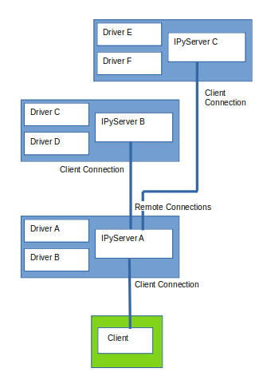

Introduction
============

indipyserver
^^^^^^^^^^^^

Server for the INDI protocol, written in Python

This package provides an IPyServer class used to serve the INDI protocol on a port.

INDI - Instrument Neutral Distributed Interface.

For further information on INDI, see :ref:`references`.

indipyserver can be installed from Pypi:

https://pypi.org/project/indipyserver/

Drivers controlling instrumentation can be written, typically using the IPyDriver class from the associated indipydriver package, this server opens a port to which an INDI client can connect.

You would create a script something like::

    import asyncio
    from indipyserver import IPyServer
    import ... your own modules creating driver1, driver2 ...

    server = IPyServer(driver1, driver2, host="localhost", port=7624, maxconnections=5)
    asyncio.run(server.asyncrun())

A connected client can then control all the drivers. The above illustrates multiple drivers can be served.

Note, the default host 'localhost' will only allow client connections from the localhost. If you want the port to allow external connections use a host name of '0.0.0.0'.

Any INDI client can be used to connect to this port, an associated client 'indipyterm' is available.

Third party drivers
^^^^^^^^^^^^^^^^^^^

IPyServer can also run third party INDI drivers created with other languages or tools, using an add_exdriver method to include executable drivers.

For example, using drivers available from indilib::

    import asyncio
    from indipyserver import IPyServer

    server = IPyServer(host="localhost", port=7624, maxconnections=5)

    server.add_exdriver("indi_simulator_telescope")
    server.add_exdriver("indi_simulator_ccd")
    asyncio.run(server.asyncrun())

Please note: The author has no relationship with indilib, these indipyserver and indipydriver packages are independently developed implementations. However they were developed with reference to the INDI version 1.7 specification, and are intended to interwork with other implementations that also meets that spec.

Networked instruments
^^^^^^^^^^^^^^^^^^^^^

IPyServer also has an add_remote method which can be used to add connections to remote servers, creating a tree network of servers::

    import asyncio
    from indipyserver import IPyServer
    import ... your own modules creating DriverA, DriverB ...

    server = IPyServer(DriverA, DriverB, host="localhost", port=7624, maxconnections=5)

    server.add_remote(host="nameofserverB", port=7624, blob_enable=True)
    server.add_remote(host="nameofserverC", port=7624, blob_enable=True)

    asyncio.run(server.asyncrun())

With such a layout, the client can control all the instruments.

Drivers made with indipydriver, third party executable drivers and remote connections can all be served together.
